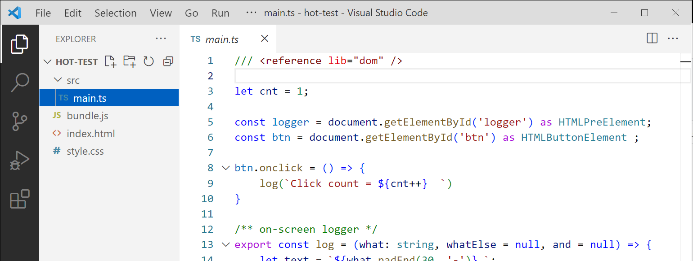

# Deno Hot Dev Server

This dev server will launch a web app and hot-restart it on any    
changes to the deno typescript client source code.   

**Yes, you read that right!** - Pure Deno Typescript client code!!!

This is accomplished by esBuilding, bundling the src to a single    
javascript bundle.js file. 

Any saved changes to the typescript code will trigger both a build and bundle.   
The `bundle` action will automatically trigger a browser refresh.   
Stylesheet changes refresh only the styles without restarting the bundle.   

## Requirements
This Hot-Serve service requires the following:
    
An index.html file with the following:    
  - must contain a \<body\>\</body\> tag (for code injection).
  - must reference a `bundle.js` file as type module    
     \<script type=module src="bundle.js"\>\</script\>
  - should have one or more stylesheets     
     \<link rel="stylesheet" href="./style.css"\>
     
  - for bundling with esbuild, a configuration must be included
 
## A good example hot app is: https://github.com/nhrones/BuenoCache/
Checkout **_/src/_** and **_/dist/bundle.js/_** there.

## Code injection (injector.ts)
The hot-browser-refresh is accomplished by emdedding a temporary   
script tag at the end of the index.html-body.   
The injected code registers a WebSocket client on the Hot-server.   
When Hot-Serve detects changes that rebuild bundle.js, it will send a   
message to the embedded socket that will force a browser refresh. 
``` 
NOTE: Code injection happens only when the content of index.html is     
served to the browser; it will not mutate the index.html file.
We inject our script tag below the body-end-tag </body>.
Anything that exists below the body-end-tag will be displaced    
below this injected script.   
``` 
See the example app in the `./dist` folder

## Usage
To install a local copy, enter:
```
deno install -n hot -A --unstable https://raw.githubusercontent.com/nhrones/Utilities/main/Hot/server.ts 
```  
Then, in a terminal in the root of your project, just enter `hot` to run this service. If the client code is not in the root folder, enter the folder name as the first cammand line arg; in this case you'll enter -- `hot example`.

Your browser will launch automatically, opening your web-app.

## Important:
Hot when first used in a project folder, will add a config json entry     
in **_./.vscode/dev.json_**.    
You can edit this config json to customise hot for this project.
```json
{
   "hot": {
      "DEV": true,
      "Entry": [
         "./src/main.ts"
      ],
      "Minify": false,
      "Out": "dist",
      "Port": 80,
      "Serve": "dist",
      "Watch": [
         "src",
         "dist"
      ]
   }
}
```
Hot will populate this config on first use (when one is not found).
The above hot-config is the default. I deals mainly with esbuild, watch, and serve params.
You can find these setting in:
https://github.com/nhrones/Utilities/blob/main/Config/readme.md

## Try it
To run this service from Git! 

In a folder that contains:   
   an index.html file,   
   a bundle.js file,   
   a src folder   
   and, a main.ts file in the src folder     


||
|:--:| 
| *Minimum HotServe Client project* |


Note the `/// <reference lib="dom" />` at the top of `/src/main.ts`,   
This allows you to write client-side deno-typescript without vscode complaints.

Try changing some code in main.ts, then save it.  The browser tab should refresh.    
Try changing the h1 color in style.css, then save.  The h1 color should change    
without restarting the app!
